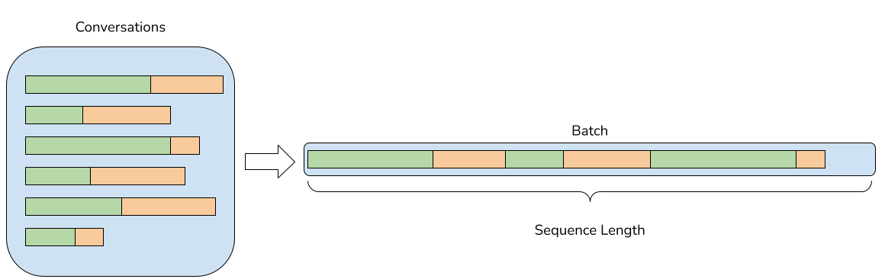
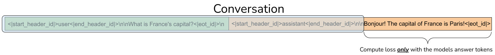
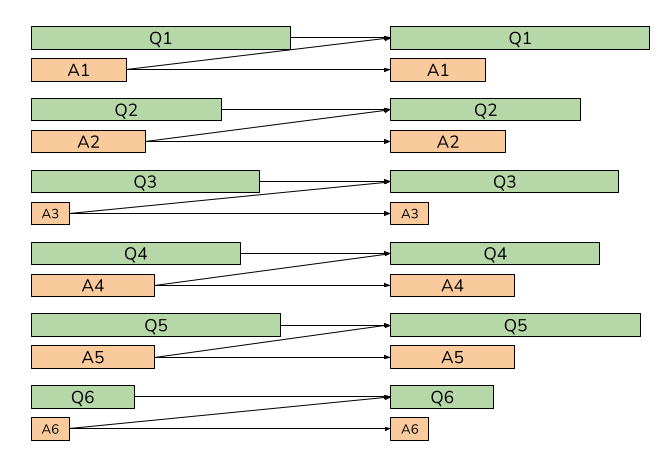

# LlamaSFT
## Introduction
We have incorporated the ability to perform SFT in nanotron with the following features:
1. Packing multiple samples to fill the sequence length of the model
2. Training on completions only: The model learns from the answers, not from the user prompt & chat templates
3. Removing cross-attention between the multiple samples packed

In the following sections, we will delve into more detail about these features and how we have implemented them.

### Feature 1: Packing
To train the models efficiently, we will pack multiple conversations into the same sample until filling the sequence length. As we are packing multiple sequences and to avoid introducing padding tokens, [we will flatten the batch size](https://github.com/swiss-ai/nanotron/blob/c026422e5bf0bc1086c039e65d8f7bbe75dc9728/src/nanotron/trainer.py#L259), so `sequence_length = micro_batch_size * sequence_length` and `micro_batch_size = 1`.


### Feature 2: Training only on completions
Conversations consist of user messages, which are usually questions or inquiries, and the model's responses. The ultimate goal is for the model to improve the quality of its responses, and not so much to learn about user questions or other aspects like the chat template. Therefore, during training, we will compute the loss only with the tokens that belong to the answers produced by the model.

To achieve this, when tokenizing the conversations, we will [store the role of each token](https://github.com/swiss-ai/nanotron/blob/c026422e5bf0bc1086c039e65d8f7bbe75dc9728/src/nanotron/data/chat_tokenizer.py#L59) and create an attention mask that the model will use in the loss computation [[1]](https://github.com/swiss-ai/nanotron/blob/c026422e5bf0bc1086c039e65d8f7bbe75dc9728/src/nanotron/models/llama_sft.py#L617), [[2]](https://github.com/swiss-ai/nanotron/blob/c026422e5bf0bc1086c039e65d8f7bbe75dc9728/src/nanotron/models/llama_sft.py#L603).


### Feature 3: Removing cross-attention
Finally, as we are packing multiple conversations together, we do not want the tokens of one conversation to attend to those of other conversations.
To do this, we will store the `position_ids` of each token in the sequence length to:
1. Apply the RoPE embeddings correctly to each conversation
2. [Create the attention mask](https://github.com/swiss-ai/nanotron/blob/c026422e5bf0bc1086c039e65d8f7bbe75dc9728/src/nanotron/models/llama_sft.py#L346) needed by [`flash_attn_varlen_func`](https://github.com/swiss-ai/nanotron/blob/c026422e5bf0bc1086c039e65d8f7bbe75dc9728/src/nanotron/models/llama_sft.py#L352) to compute the attention without cross-contamination between different conversations


## Internals
### Config file
For SFT, we need to setup the config file as follows:
```yaml
- data:
    dataset:
      hf_dataset: Magpie-Align/Magpie-Pro-300K-Filtered
      hf_dataset_split: train
      conversation_column_name: conversations
      train_on_completions_only: true
      remove_cross_attention: true
    num_loading_workers: 1
    seed: 42
  name: General purpose training (Single dataset)
  start_training_step: 1
```
The `hf_dataset` should be a dataset from the HuggingFace Hub with the same structure as `Magpie-Align/Magpie-Pro-300K-Filtered`; that is, each conversation will be a list of dictionaries, each with the keys `from` [`gpt`, `human`] and `value`. We can select a split with `hf_dataset_split` and the dataset column with `conversation_column_name`. `train_on_completions_only` & `remove_cross_attention` are to toggle on/off Features 2 and 3, but we will remove them for the final release.

### Iterable Dataset
For SFT training, we have developed a new dataset, [`ChatDataset`](https://github.com/swiss-ai/nanotron/blob/c026422e5bf0bc1086c039e65d8f7bbe75dc9728/src/nanotron/data/chat_dataset.py#L17), responsible for producing data batches during training. Unlike `Nanosets`, this new `ChatDataset` is an [`IterableDataset`](https://pytorch.org/docs/stable/data.html#iterable-style-datasets). The advantage of this type of dataset is that they do not require preprocessing the data before training as they do it on-the-fly, saving us the preprocessing step and the space occupied by the preprocessed data. The downside is that it is not trivial to recover the state of the DataLoader when restarting training. For this, we are developing a solution based on `torchdata`'s [`StatefulDataLoader`](https://github.com/pytorch/data/tree/main/torchdata/stateful_dataloader) that we will incorporate soon.

For now, we allow splitting the dataset between the different data parallel ranks and plan to support interleaved datasets.

### ChatTokenizer
To apply the chat template, tokenize the conversations, and store the role of each token, we have developed the [`ChatTokenizer`](https://github.com/swiss-ai/nanotron/blob/c026422e5bf0bc1086c039e65d8f7bbe75dc9728/src/nanotron/data/chat_tokenizer.py#L6). Based on the one included in [`meta/llama3`](https://github.com/meta-llama/llama3/blob/main/llama/tokenizer.py), [this tokenizer will return](https://github.com/swiss-ai/nanotron/blob/c026422e5bf0bc1086c039e65d8f7bbe75dc9728/src/nanotron/data/chat_dataset.py#L92) the `tokens` of the conversation and the list of bools `is_completions` indicating whether the token belongs to the model's responses or not, necessary for Feature 2.

For now, we only support the Llama3 tokenizer along with the official chat template of this model.

### Recover DataLoader
Pending development
